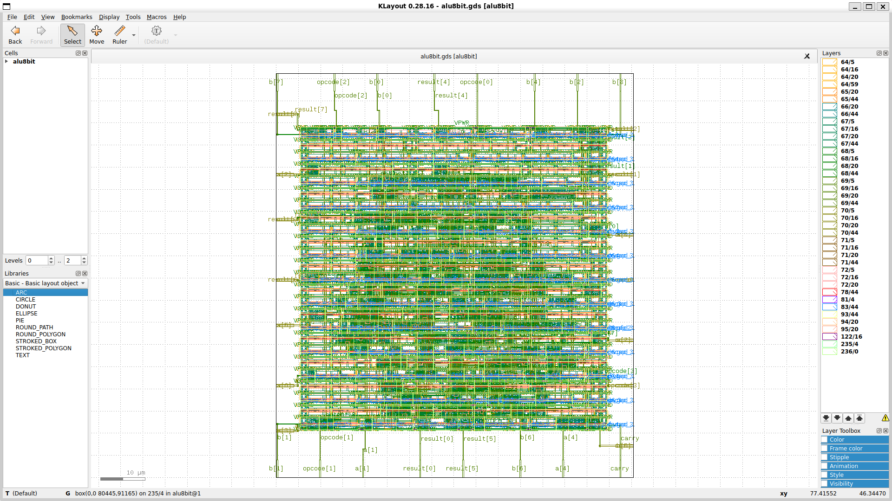

# 8-bit ALU OpenLane Project

## Project Overview
- **RTL Design**: Verilog code for 8-bit ALU located in `src/`.
- **Synthesis & Layout**: Floorplan, placement, CTS, routing, and GDS generation performed using OpenLane.
- **Signoff Reports**: Area, power, and timing analysis included.
- **DRC/LVS Verification**: Layout checked against design rules and netlist.
- **Final GDS-II Layout**: Ready for documentation and review.

---

## Design Statistics
- **Chip area (from synthesis)** → 1445.136 µm²  
- **Cell count (from synthesis)** → 160  
- **Die/Core area (from floorplan)** → 80.445 × 91.165 µm² and 4692 µm²  

---

## Folder Structure
├── results/ # Final GDS, reports, and signoff outputs
├── README.md # Project documentation
├── alu8bit.gds.png # GDS snapshot (for visualization in README)
├── alu8bit.v # Verilog RTL file for 8-bit ALU
└── config.json # OpenLane configuration file

---

## Flow Steps
1. Synthesis of RTL  
2. Floorplanning & placement  
3. Clock tree synthesis (CTS)  
4. Routing  
5. Signoff (area, power, timing)  
6. DRC/LVS verification  
7. Export of final GDS layout  

---

## Final Layout
- Open **`alu8bit.gds`** in KLayout for visualization  
- Open **`alu8bit.magic.gds`** in Magic for editing/debug  

**GDSII Snapshot:**  



---

## Verification
- **DRC Report**: `drc.rpt` → Clean  
- **LVS Report**: `32-alu8bit.lvs.rpt` →  Matched (LVS Clean)  

---

## Repository
```bash
git clone https://github.com/RajHiremath-510/alu8bit_openlane.git

## Installation 
Refer to the video for OpenLane installation https://youtu.be/nBz9oFpbTv4?si=MG42k84mPf74VmUy
